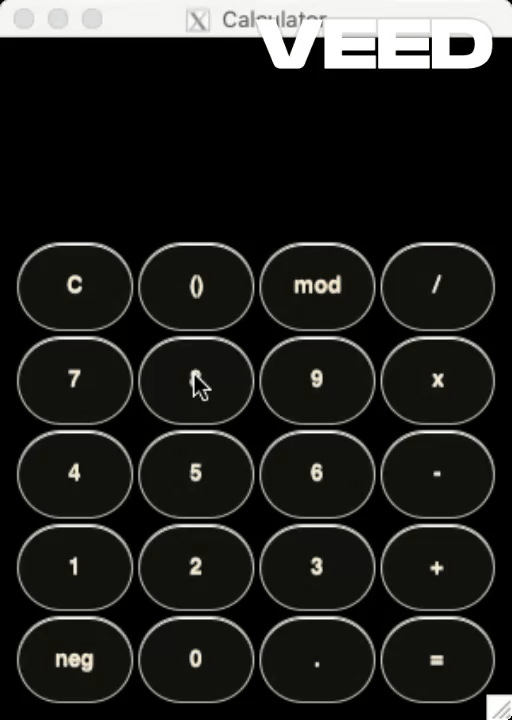

# GTK Flexi Calc

Scalable calculator with basic arithmetic operations (addition, subtraction, and multiplication) built with the GTK Framework.



Currently in development

## Usage

1) Compile the ui template into a C file resources.c
```
glib-compile-resources calculatorapp.gresource.xml --target=resources.c --generate-source
```

2) Compile resources.c with the rest of the source code
```
gcc -o calculatorapp main.c calculatorapp.c calculatorappwin.c resources.c calculatorbutton.c `pkg-config --cflags --libs gtk+-3.0` -rdynamic
```

3) Run the executable file
```
./calculatorapp
```
